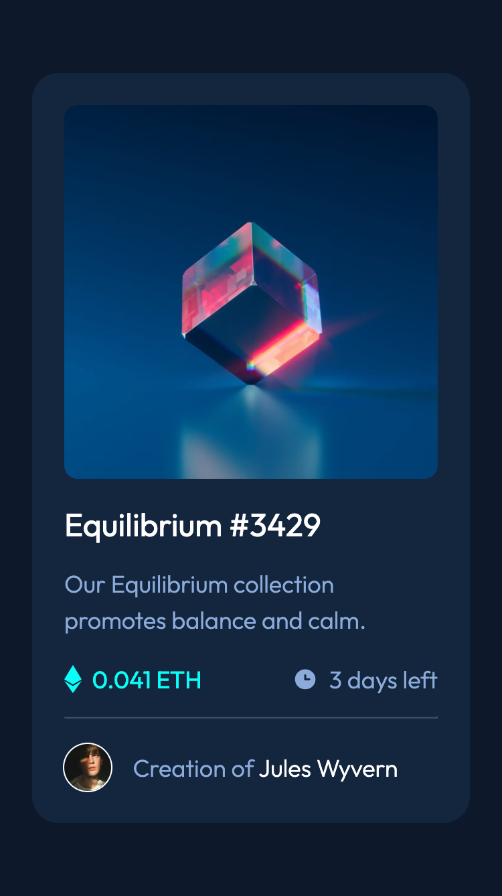
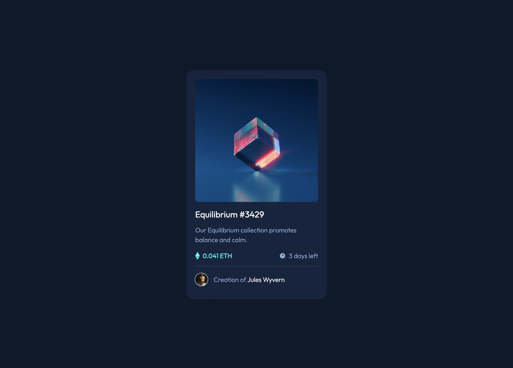
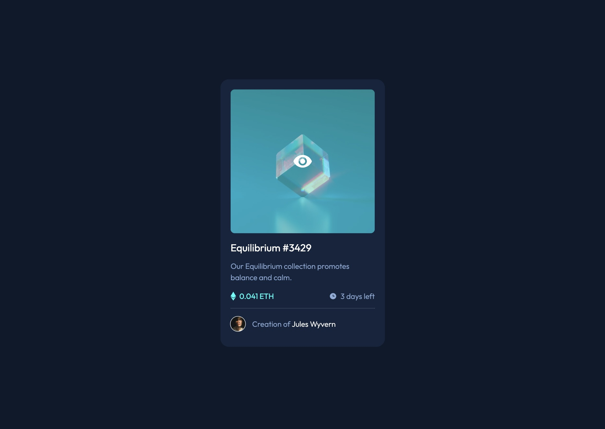

# Frontend Mentor - NFT preview card component solution

This is a solution to the [NFT preview card component challenge on Frontend Mentor](https://www.frontendmentor.io/challenges/nft-preview-card-component-SbdUL_w0U). Frontend Mentor challenges help you improve your coding skills by building realistic projects. 

## Table of contents

- [Overview](#overview)
  - [The challenge](#the-challenge)
  - [Screenshot](#screenshot)
  - [Links](#links)
- [My process](#my-process)
  - [Built with](#built-with)
  - [What I learned](#what-i-learned)
  - [Continued development](#continued-development)

## Overview

### The challenge

Users should be able to:

- View the optimal layout depending on their device's screen size
- See hover states for interactive elements

### Screenshot





### Links

- Solution URL: [GitHub](https://github.com/Ayako-Yokoe/nft-preview-card-component-main)
- Live Site URL: [Vercel](https://nft-preview-card-component-puce-theta.vercel.app/)

## My process

### Built with

- Semantic HTML5 markup
- CSS custom properties
- Flexbox
- Mobile-first workflow
- BEM methodology

### What I learned

I learned how to name classes using the BEM methodology. It makes classes easier to read and organize.

```html
<div class="contents">
  <div class="contents__img__wrapper">
    
  </div>
  <h1 class="contents__title">Equilibrium #3429</h1>
  <p class="contents__description">Our Equilibrium collection promotes balance and calm.</p>
```
```css
.contents__img {
  ...
}
.contents__title {
  ...
}
.contents__description {
  ...
}
@media screen and (min-width: 768px) {
	.contents__img__wrapper {
    ...
	}
	.contents__img__wrapper::after {
    ...
	}
}
```

### Continued development

I will familiarize myself with CSS methodologies to write readable code that adheres to company policies.
